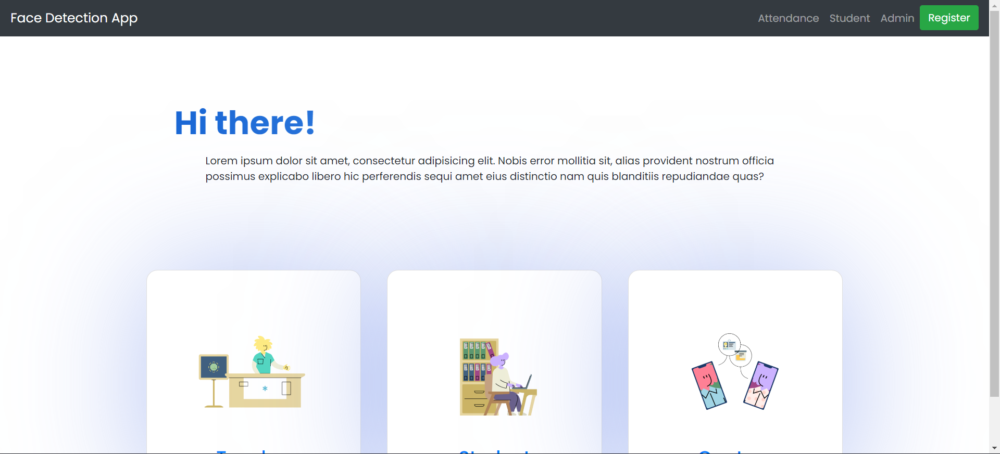

# Face Recognition Attendance

This is a simple webapp which uses Azure cognitive services for face recognition.
I've used Azure Face Recognition API to take attendace of students.


*****

## Local Setup Guide

- To setup this project for local development, you need to have Microsoft Azure account which is free for limited credits.

**Get your free account [Here](https://azure.microsoft.com/en-in/free/)**

- After creating an account, you need to create an Face Recognition Service.

**Guide for creating [Face Recognition Service](https://azure.microsoft.com/en-in/services/cognitive-services/face/)**

- After that you will receive Subscription keys. Keep them safe, don't reveal them.

- Now install python dependencies using :

    ```pip install -r requirements.txt```

    _Note : Creating virtual environment is suggested_

- After that go to `src` folder and create a `.env` file there.

- In that `.env` file put the following contents : 

    ```
    Ocp-Apim-Subscription-Key = {YOUR_SUBSCRIPTION_KEY}
    Ocp-Apim-Subscription-Region = {YOUR_REGION}
    BASE_URL = {YOUR_BASE_URL}
    PERSONGROUP_ID = {YOUR_PERSONGROUP_ID}
    ```
- After that run the app by using :
    
    ```
    python app.py
    ```

_Refer to Azure Face API docs for more information_

****

## Screenshots




